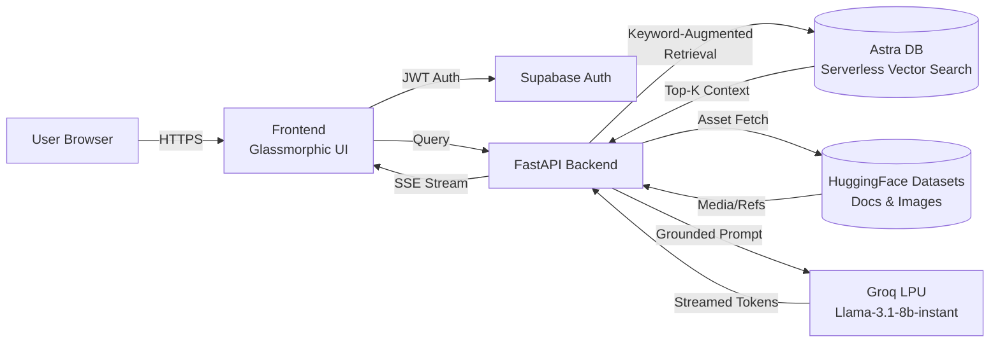

<div align="center">

# 🧠 Placebo AI
### Medical Intelligence Platform — Serverless RAG at LPU Speed

[](https://trinetralabs-placeboai.hf.space/)
[](#license)
[](#)
[](#)
[](https://groq.com/)

**Instant, medically-grounded answers backed by 1.3M+ medical text vectors — with zero local disk footprint.**

[Live Demo](https://trinetralabs-placeboai.hf.space/) · [Architecture](#-architecture) · [Setup](#%EF%B8%8F-installation--setup) · [Deployment](#-deployment)

</div>

---

## 📖 Overview

**Placebo AI** is a cloud-native medical intelligence platform that combines retrieval-augmented generation (RAG) with a fully serverless data layer. Rather than shipping a multi-gigabyte vector index alongside the application, Placebo AI offloads all heavy assets — embeddings, document text, and images — to managed cloud services, leaving the application itself lightweight, stateless, and trivially deployable to any container platform.

The result is a system that can answer nuanced medical questions with grounded, source-backed context, streamed back to the user in near real-time thanks to Groq's LPU (Language Processing Unit) inference engine.

> **Disclaimer:** Placebo AI is an informational and educational tool. It is not a substitute for professional medical diagnosis, advice, or treatment. Always consult a qualified healthcare provider for medical concerns.

---

## 🏗️ Architecture

Placebo AI's architecture was deliberately redesigned to eliminate the operational fragility of local, disk-resident datasets. The migration removed a 17GB vector store and an 88GB image corpus from the application's runtime footprint entirely, replacing them with serverless equivalents that scale independently of the app container.



### Design Principles

| Principle | Implementation |
|---|---|
| **Zero local footprint** | All vector and asset data lives in managed cloud stores; the container ships with no bundled dataset. |
| **Stateless compute** | The FastAPI backend holds no persistent state, enabling horizontal scaling and instant cold starts. |
| **Grounded generation** | Retrieval context is injected into strict XML-bounded prompts to reduce hallucination and keep the model anchored to retrieved evidence. |
| **Fail-safe by design** | Because there's no local dataset to load into memory, the architecture is immune to out-of-memory (OOM) crashes that plagued the previous local-dataset version. |

---

## 🧩 Tech Stack

| Layer | Technology | Purpose |
|---|---|---|
| **Vector Database** | [DataStax Astra DB](https://astra.datastax.com/) | Serverless cloud-native vector search over 1.3M+ medical text embeddings |
| **LLM Inference** | [Groq](https://groq.com/) — Llama-3.1-8b-instant | Ultra-low-latency token streaming via custom LPU hardware |
| **Asset Storage** | [HuggingFace Datasets](https://huggingface.co/) | Serverless retrieval of source documents and images |
| **Backend Framework** | FastAPI (Python) | Async API layer, request validation, streaming responses |
| **Authentication** | Supabase Auth | JWT-based session management and identity verification |
| **Frontend** | HTML/CSS/JS (glassmorphism, custom animations) | Clinical, responsive UI optimized for accessibility and SEO |
| **Deployment** | Docker (HuggingFace Spaces, Render, Railway, Vercel-compatible) | Portable, serverless-friendly container |

---

## ⚡ Key Features

- **Zero Local Footprint** — The former 17GB vector database and 88GB image archive have been fully migrated off-disk to Astra DB and HuggingFace Datasets respectively. The running application requires negligible local storage.
- **Lightning-Fast Inference** — Powered by Groq's LPU architecture, responses stream token-by-token with minimal latency compared to traditional GPU-based inference.
- **Keyword-Augmented RAG Retrieval** — A custom retriever layer blends semantic vector search with keyword-based re-ranking to improve relevance on medical terminology and abbreviations.
- **Strict XML Prompt Boundaries** — All retrieved context is wrapped in explicit XML tags before being passed to the LLM, reducing prompt injection risk and improving grounding fidelity.
- **Secure Authentication** — Supabase-issued JWTs are verified server-side on every protected request, ensuring session integrity without maintaining server-side session state.
- **Accessibility & Performance** — The frontend achieves perfect 100/100 Accessibility and SEO scores on Google Lighthouse, with a responsive, glassmorphic clinical interface.
- **Platform-Agnostic Deployment** — Being fully serverless on the data side, the same Docker image can be deployed to HuggingFace Spaces, Render, Railway, Vercel, or any container-compatible host without modification.

---

## 🔌 API Overview

> Update endpoint paths/names below to match your actual FastAPI routes — placeholders shown for structure.

| Method | Endpoint | Description | Auth Required |
|---|---|---|---|
| `POST` | `/api/query` | Submit a medical question; returns a streamed, RAG-grounded response | ✅ |
| `GET` | `/api/health` | Service health check | ❌ |
| `POST` | `/api/auth/session` | Validate Supabase JWT and establish a session context | ✅ |
| `GET` | `/api/sources/{doc_id}` | Retrieve a specific source document/image reference | ✅ |

---

## 🛠️ Installation & Setup

### Prerequisites

- Python 3.10+
- A Groq API key
- A DataStax Astra DB instance (serverless vector-enabled)
- A Supabase project (for authentication)

### 1. Clone the repository

```bash
git clone https://github.com/labstrinetra/placebo.ai.git
cd placebo.ai
```

### 2. Install dependencies

```bash
pip install -r requirements.txt
```

### 3. Configure environment variables

Create a `.env` file in the project root:

```env
GROQ_API_KEY=your_groq_api_key
ASTRA_DB_API_ENDPOINT=your_astra_endpoint
ASTRA_DB_APPLICATION_TOKEN=your_astra_token
SUPABASE_URL=your_supabase_url
SUPABASE_ANON_KEY=your_supabase_key
```

### 4. Run the application

```bash
python src/app.py
```

The application will be available at `http://localhost:8000`.

---

## 📦 Deployment

Placebo AI is live in production on **HuggingFace Spaces**, running in a custom Docker container:

🔗 **Live URL:** [https://trinetralabs-placeboai.hf.space/](https://trinetralabs-placeboai.hf.space/)

Because all heavy data lives off-container, the exact same repository can be deployed to any of the following without disk or memory tuning:

- **Render** — Docker web service, no persistent disk required
- **Railway** — one-click Docker deploy from GitHub
- **Vercel** — via Docker-compatible serverless functions (API routes)
- **HuggingFace Spaces** — current production host (Docker SDK)

### Deployment Checklist

- [ ] All environment variables set in the host platform's secrets manager (never commit `.env`)
- [ ] `app_port` matches the platform's expected port (7860 for HF Spaces, configurable elsewhere)
- [ ] Astra DB and Supabase projects are on production-tier plans if expecting sustained traffic
- [ ] Groq API rate limits reviewed for expected concurrent load

---

## 🔒 Security Notes

- JWTs issued by Supabase are verified server-side on every authenticated request; no session state is persisted in the application.
- API keys and database tokens are read exclusively from environment variables — never hardcoded or logged.
- Retrieved context is sandboxed within explicit XML boundaries before being passed to the LLM, limiting the blast radius of prompt-injection attempts embedded in source documents.

---

## 🗺️ Roadmap

- [ ] Multi-turn conversational memory with session-scoped context windows
- [ ] Source citation UI (inline links to retrieved documents/images)
- [ ] Admin dashboard for corpus management and query analytics
- [ ] Rate limiting and usage quotas per authenticated user

---

## 🤝 Contributing

Contributions, issues, and feature requests are welcome. Please open an issue first to discuss significant changes before submitting a pull request.

---

## 📄 License

Distributed under the MIT License. See `LICENSE` for details.

---

<div align="center">

*Developed by **Trinetra Labs***

</div>
