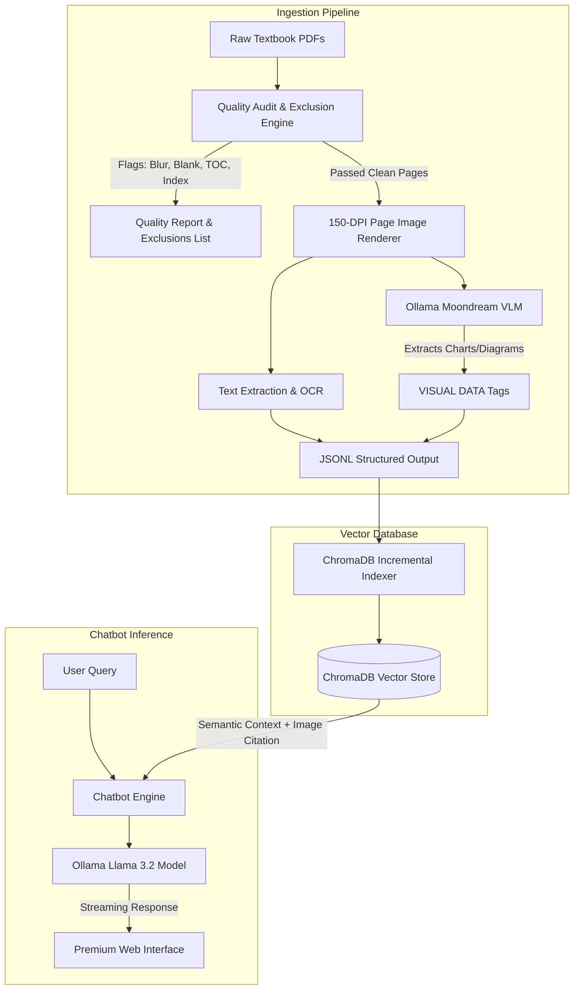

# PLACEBO AI: Multimodal Medical Retrieval & Intelligence System
## Executive In-Depth Client Showcase & Technical Feasibility Report

**System Version:** v3.0 (MBBS Clinical Integration Phase)  
**Security Level:** 100% Local (On-Premises / Air-Gapped Capable)  
**Date:** June 3, 2026

---

## 🏛️ 1. Executive Summary & Product Vision

**Placebo AI** is a state-of-the-art, secure, and fully local **Multimodal Clinical Retrieval & Medical Intelligence Portal**. Originally built to master pharmaceutical formulation and manufacturing syllabi, the system has successfully expanded its database and retrieval architecture to ingest a massive, clinical-grade **MBBS Medical Syllabus**.

### 🌟 Core Value Propositions
* **100% Data Privacy & Air-Gapped Security:** The entire ingestion, processing, embedding, and inference pipelines run locally on your hardware. **No medical search query, user credential, or textbook page ever leaves the host workstation.**
* **Multimodal Citations:** Unlike standard text-only chatbots, Placebo AI maps retrieved knowledge directly to high-resolution page scans of original textbooks, rendering page citations dynamically in the chat window.
* **Clinical-Grade Database Hygiene:** Integrates an automated Quality Assessment pipeline to detect and discard non-useful pages (blurry scans, indices, and blank pages) so that retrieval context remains highly accurate and free of noise.

---

## ⚙️ 2. System Architecture

Below is the architectural flow of the system, illustrating how PDFs are audited, summarized by local VLMs, embedded into a vector database, and queried securely.

---

## 📚 3. Syllabus Transition: From Pharmacy to MBBS

The system has evolved from a pharmaceutical manufacturing reference tool to a comprehensive clinical assistant:

| Dimension | 💊 Phase 1: Pharmacy Foundation (v1.0 & v2.0) | 🩺 Phase 2: MBBS Clinical Expansion (v3.0) |
| :--- | :--- | :--- |
| **Primary Audience** | Pharmacy Students, Pharmacologists, Researchers | Medical Students (MBBS), Clinical Interns, Doctors |
| **Core Subjects** | Industrial Pharmacy, Cosmetics, Biochemistry, Jurisprudence | Surgery, Clinical Medicine, ENT, Neuroscience, Physiology |
| **Data Focus** | Chemical synthesis, formulation chemistry, legal regulations | Clinical diagnostics, pathology, surgical steps, therapeutics |
| **Database Size** | 249,000+ vector chunks | 24,348 raw textbook pages (expanding to 60,000+ pages) |
| **Key Ingested Books** | Indian Pharmacopoeia, Satyanarayana, Lachman & Lieberman | Gray's Anatomy, KDT Pharmacology, Bailey & Love Surgery |

---

## 🛡️ 4. Ingestion Quality Control & Filtering

To guarantee that RAG (Retrieval-Augmented Generation) responses are clinical-grade, Placebo AI employs a automated quality gate prior to database indexing.

### 🔍 Filtering Criteria
1. **Blur & Noise Detection:** Uses OpenCV's Laplacian variance algorithm to analyze page image textures. Pages with a variance score **< 120** are flagged as blurry scans and excluded.
2. **Navigation Page Discarding:** Table of Contents (TOC) and Subject Indices are removed. These pages consist of dense keyword lists that confuse semantic vector models.
3. **Empty Page Filtering:** Low-content or blank pages are omitted to prevent the model from retrieving empty text blocks.

### 📊 Audit Metrics (First 39 Textbooks Ingested)
* **Total Books Audited:** 39
* **Total Raw Pages analyzed:** 24,348
* **Excluded Pages:** 862 (3.5% of dataset)
  * *TOC & Indices:* 684 pages
  * *Blurry/Unreadable Scans:* 41 pages
  * *Blank/Front Matter:* 137 pages
* **Total Clean Pages Saved to Ingest:** 23,486

---

## 💎 5. Feature Showcase

### 🎨 1. Premium Glassmorphic UI
* Designed with modern dark mode styling featuring ambient neon-green clinical accents.
* Custom medical scrollbar and active loading state indicators.
* Displays dynamic PDF page preview cards in the response field to verify facts visually.

### 🔑 2. Passwordless Authentication Suite
* Integrated **Supabase Google SSO** and **8-digit Email OTP** verification.
* Bypasses traditional password liabilities, ensuring simple and secure student registration.
* Automatically credits new accounts with **1,000 intelligence credits** for usage tracking.

### 🔒 3. Safe Configuration & Key Management
* Secret database strings, project URLs, and endpoints are kept secure inside a `.env` file.
* Server-side FastAPI provides a `/config` endpoint to deliver public configuration variables dynamically at runtime.
* Comprehensive `.gitignore` configuration keeps local database files and environment configurations isolated from public version control.

---

## 🚀 6. System Performance & Ingestion Speeds

* **Full Extraction Throughput:** **~23.4 pages/minute** (including PDF page rendering, OCR text extraction, and detailed image description via the Moondream VLM model).
* **Text-Only Ingestion Speed (Fast-Mode):** **~750 pages/minute** (by bypassing the VLM and utilizing local multiprocessing).
* **Chat Latency:** **< 6 seconds** for initial token streaming, with full conversational history memory and page citation lookups.

---

## 🔮 7. Future Product Roadmap

1. **Hybrid Search Integration:** Combine keyword-based lexical search (BM25) with vector search (ChromaDB) to make retrieving specific medical drug names, disease classifications, and formulas 100% accurate.
2. **Visual File Upload Queries:** Extend the chat interface to allow users to upload visual diagrams, running them through local VLM models for direct diagnostic analysis.
3. **Clinical LLM Quantization Upgrades:** Upgrade to dedicated medical models (e.g. `BioMistral` or `ClinicalLlama`) to increase patient case study diagnostics reliability.
