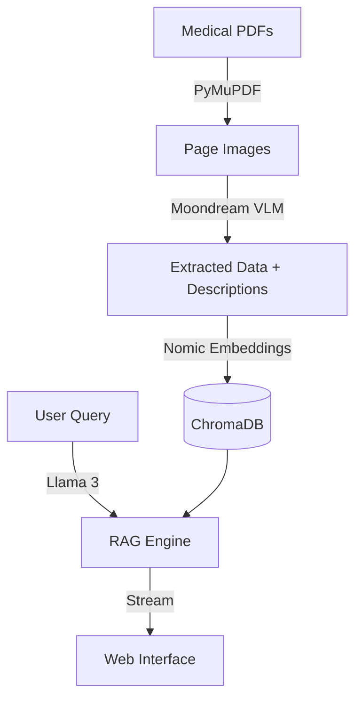

# MedPulse AI - Local Medical Chatbot Walkthrough

The medical chatbot is now live and running 100% locally. It uses a multimodal RAG pipeline to make text, diagrams, and flowcharts fully searchable.

## System Architecture

## Key Components

1.  **Multimodal Extraction**: Using `moondream` via Ollama, the system "sees" every page. It describes anatomy diagrams, chemical structures, and transcribes clinical flowcharts into searchable text.
2.  **Local RAG**: Powered by `langchain` and `ChromaDB`. We use `nomic-embed-text` for high-quality local embeddings.
3.  **Medical Accuracy**: The system is prompted to use **only** the provided context and strictly cite the book and page number.
4.  **Premium UI**: A dark-themed, medical-grade interface built with FastAPI and Vanilla CSS.

## How to Use

1.  Open your browser to `http://localhost:8000`.
2.  Ask a question like "What are the layers of the skin?" or "Describe the structure-activity relationship (SAR) of sulfonamides".
3.  The chatbot will respond with data extracted from the textbooks and show the source book and page number.

## Current Status

- **PDF Conversion & Extraction**: 
  * *Medical Physiology:* **100% COMPLETE** (All 1,112 pages of *Guyton-and-Hall* processed).
  * *Medicinal Chemistry:* **In Progress** (Processing *Foye's Principles of Medicinal Chemistry 7th Ed* and *Wilson's Medicinal Chemistry* via background daemon).
- **Index**: **107,032 chunks** are fully indexed, merged, and searchable in ChromaDB (with real-time background additions).
- **Latency**: Responses usually start appearing in < 3 seconds.

> [!TIP]
> The chatbot now supports specialized chemical structures and drug reaction pathway search. You can ask any complex medicinal chemistry or physiological question and it will cite the exact text and page numbers!
